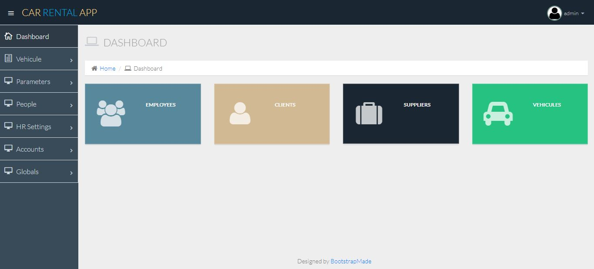

## Description

The main objective of this project is to develop a simple car rental project. It manages all the information concerning the car reservation, maintenance, employees, customer, suppliers, maintenance, invoices the project is totally built on the administrative side and only the administrator can access it. 
  

## Demo

https://vehicules-springboot.herokuapp.com/  
  
## Screenshots

## Source code

https://github.com/aniskchaou/CARFLEET-SPRING  
  

## Technologies

Spring boot, Thymeleaf, NiceAdmin